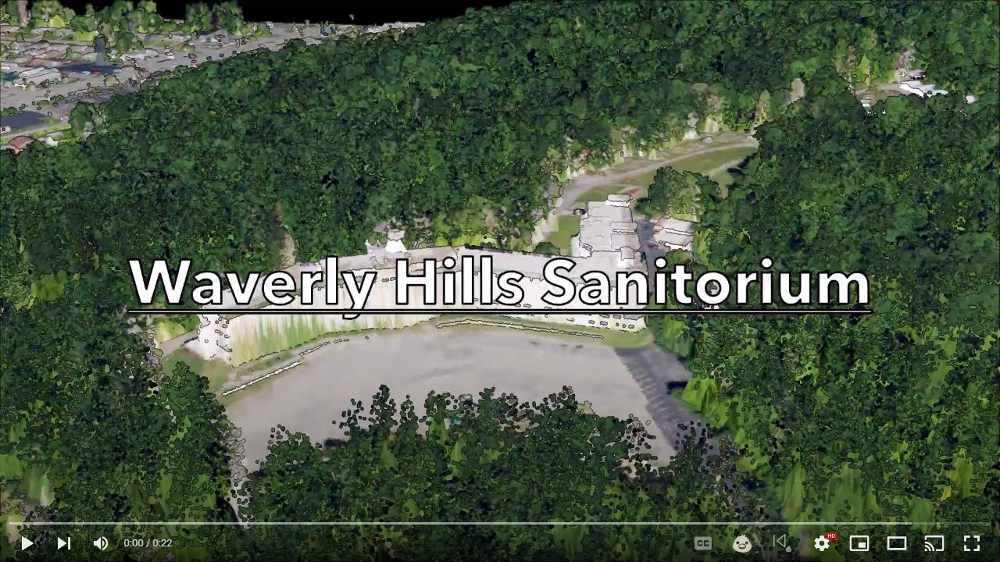

# GEO 409: Waverly Hills Sanatorium Point Cloud
By Maire Birdwell

Here contains a representation of Waverly Hills Sanatorium in Lousiville Kentucky through point cloud data. 

*LiDAR point cloud representation of Waverly Hills Sanatorium*

[Link of Waverly Hills Layout](WaverlyLayout.pdf)

     
*[GEO 409: Waverly Hills Sanatorium LiDAR Point Cloud Animated Video](https://www.youtube.com/watch?v=nFV8ftGN0aM)*
